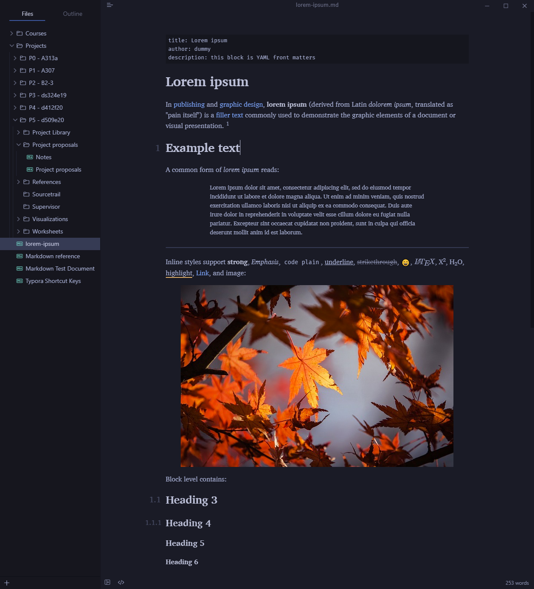
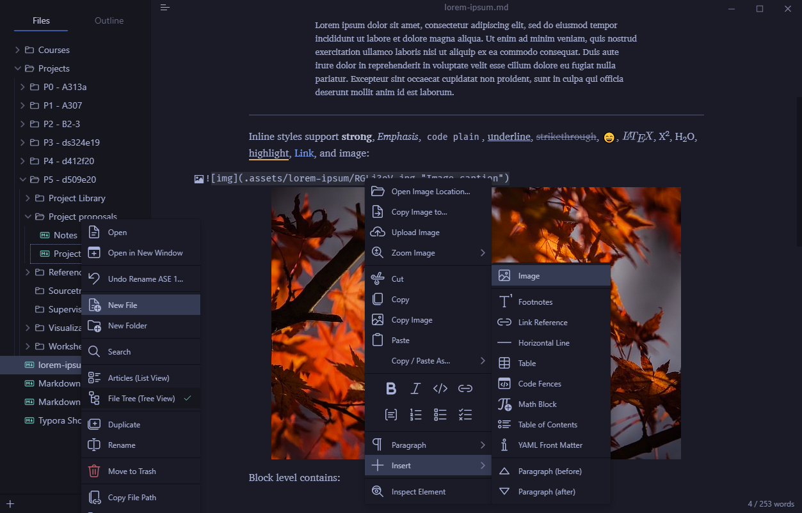
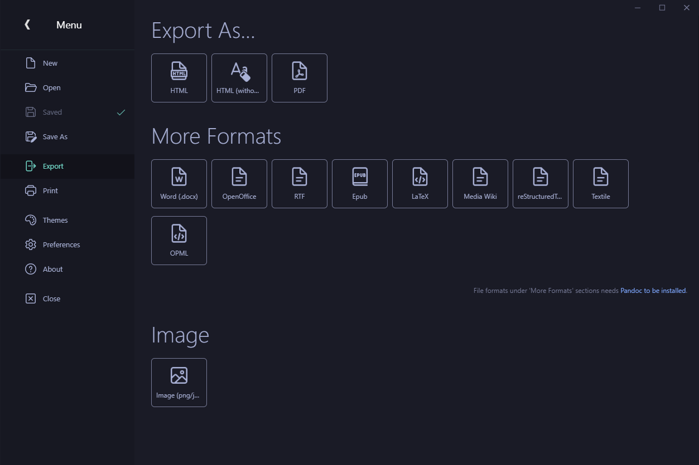
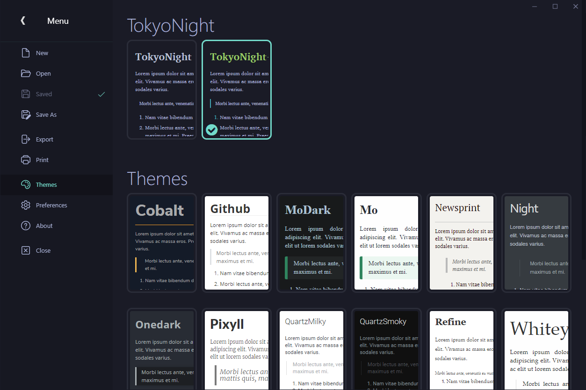

# Tokyo Night

A theme for [Typora](https://typora.io/), using icons from [Icons8](https://icons8.com).

---

---

The TokyoNight+ variant has more colors, kinda' like syntax highlighting for your notes.

---

The TokyoNight theme adds icons to a lot of the menus in Typora.

---

The Unibody Mega Menu also received the TokyoNight treatment.

---

TokyoNight currently has two variants, accessed in the `Themes` section.

---